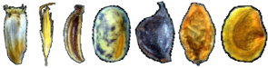

```{r setup, include=FALSE}
knitr::opts_chunk$set(echo = TRUE)
```

# seedr



## Overview

`seedr` is an R package that provides functions to fit hydro and thermal time germination models. These models characterize seed lots by two sets of parameters: (i) the physiological thresholds (water, temperature) between which the seed lot can germinate, and (ii) the physiological-time units that the seed lot needs to accumulate before it can germinate. `seedr` fits the hydro time model of Bradford (Gummerson 1986, Bradford 1990, Bewley et al. 2013) and the thermal time model of Garcia-Huidobro (Garcia-Huidobro et al. 1982, Gummerson 1986, Bewley et al. 2013). It allows to fit models to grouped datasets, i.e. datasets containing multiple species, seedlots or experiments.

## Installation

## Usage

```{r }
library(seedr)
physiotime(grasses, # germination dataset
           x = "psi", # experimental treatment
           method = "bradford", # hydrotime model
           groups = c("species")) # group dataset by species
```

## References

* Bewley, J. D., Bradford, K. J., Hilhorst, H. W., & Nonogaki, H. (2013). Thermal Time Models. In *Seeds: Physiology of Development, Germination and Dormancy, 3rd Edition* (pp. 312-317). Springer, New York, NY.
* Bradford, K. J. (1990). A water relations analysis of seed germination rates. *Plant Physiology*, 94(2), 840-849.
* Garcia-Huidobro, J., Monteith, J. L., & Squire, G. R. (1982). Time, temperature and germination of pearl millet (Pennisetum typhoides S. & H.) I. Constant temperature. *Journal of Experimental Botany*, 33(2), 288-296.
* Gummerson, R. J. (1986). The effect of constant temperatures and osmotic potentials on the germination of sugar beet. *Journal of Experimental Botany*, 37(6), 729-741.
